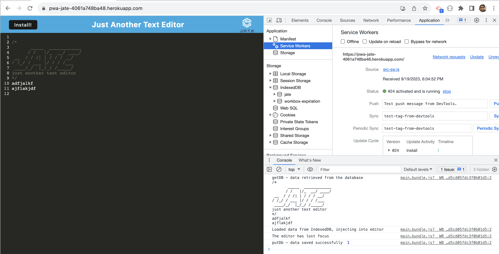

# 19-PWA-TextEditor

[](http://choosealicense.com/licenses/mit/)

## Description
A text editor that runs in the browser. The app is a single-page application that meets the PWA criteria. Additionally, it features a number of data persistence techniques that serve as redundancy in case one of the options is not supported by the browser. The application will also function offline.

## Table of Contents
 - [Installation](#installation)
 - [Usage](#usage)
 - [Credits](#credits)
 - [License](#license)
 - [Contributor](#contributor)

## Installation
Clone the github repo as shown below, <br/><br/> ``` git clone git@github.com:chandraucb/19-PWA-TextEditor.git ``` <br/><br/> Run node package install from project directory <br/><br/> 
``` 
npm install 
npm run build 
npm start //To start the server locally
```

## Usage
Application is deployed using Heroku and can be accessed using below link, https://pwa-jate-4061a748ba48.herokuapp.com/




## Credits
https://webpack.js.org/configuration/
https://webpack.js.org/loaders/css-loader/
https://www.npmjs.com/package/webpack-pwa-manifest


## License
Copyright (c) 2023 Chandrasekar Mohan
Licensed under the MIT License


## Contributor
Code contributions are welcome! <br> To contributre, make a fork and clone of the project to your local repo to include your changes. <br> Once changes are ready, create a pull request to merge them to main branch. <br> Include CONTRIBUTOR.md to get the credits


## Questions 
  Name : Chandrasekar Mohan 
  Git profile : https://github.com/chandraucb 
  Contact email : chandrasekar.mohan@gmail.com 
  Reach me through email with additional questions

